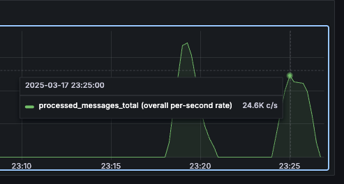

## Description

This project implements a distributed system that processes messages published on a Redis channel. The primary goal is to implement consumer groups that subscribe to the publishing channel while ensuring that each message is consumed and processed by only one consumer.  

### **Architecture**  
The system relies on **dispatcher services**, which compete for a **leader lock**. The instance that successfully acquires the lock is responsible for distributing messages.  

The **dispatcher service**:  
- Launches three worker services to handle message distribution.  
- Establishes WebSocket connections with consumers.  
- Terminates all workers immediately if it loses the leader lock or encounters a failure, preventing inconsistent writes.  

The **consumer services**:  
- Run as WebSocket servers, listening on a preconfigured port.  
- Process messages and store results in a Redis stream.  
- Send an `ACK` response to the dispatcher worker after successfully processing a message.  
- Upon acknowledgment, the message is removed from a Redis **sorted set**, which efficiently tracks unacknowledged messages eligible for redistribution.  

### **Service Discovery & Connection Handling**  
The dispatcher discovers consumer services via environment variables that specify their addresses. The assumption is that if these addresses are provided, they are expected to be valid. The worker responsible for downstream communication continuously attempts to reestablish connections if they drop. Consumer availability is tracked both **in memory** and in a **Redis list**, though the Redis entry is not actively utilized.  

### **Message Transfer Protocol**  
Communication occurs over a **custom protocol** on top of WebSockets, structured as follows:  
- **1st byte**: Protocol version  
- **2nd byte**: Command  
- **Next 4 bytes**: Message length  
- **Remaining bytes**: Payload  

This design aimed to **minimize JSON deserialization overhead** and reduce unnecessary bytes. However, after architectural changes affecting the payload structure between services, a simpler approach could have been to append the command character to the message string. This would have achieved the same result while only requiring an agreement on ASCII character mappings for different operations.

### **Performance & Reliability**  
Under the current configuration, the system typically achieves the following numbers for batches of 10 000 messages for 2 minute long tests and at least one dispatcher shutdown:  
- **0% reprocessed messages**  
- **0.5% to 1% lost messages** 
- **Handling of ~3.1 million messages per test run**  



You may read more about the initial idea [here](docs/PRELIMINARY_IMPLEMENTATION_IDEA.md)

## How to Run 

This project uses **Yarn workspaces**. Running `yarn install` in the root directory will install all dependencies.  

However, for testing purposes and to avoid setting up all environment files manually, it's recommended to start the services using **Docker Compose**:  

```sh
yarn compose:start  # Ensure Docker is running
```  

Then to start the publishing process run

```sh
yarn publisher:start   # start the python script
```

### What the Compose Stack Includes  

- 3 instances of **Consumer Service** 
- 2 instances of **Dispatcher Service** 
- **Redis** instance
- **Grafana** – for monitoring  
- **Pumba** – for chaos testing (randomly stops and restarts one container every ~15 seconds)  

Pumba helps validate **message redistribution** and tests how quickly a new leader is assigned and reconnects with consumers.  

### Additional Scripts  

There's a workspace called `scripts` that contains a simple Node.js script with two functions used for testing:  

- One function checks if any messages were **processed more than once**.  
- To use it, uncomment the relevant function, comment out the others, and run:  

  ```sh
  yarn scripts:start
  ```  

### Grafana Setup  

Once the stack is running, you can access **Grafana** on the port specified in the Compose configuration.  

To set up **Loki** and **Prometheus** as data sources, use the following format for their addresses:  

```plaintext
http://<container-name>:<container-port>
``` 

This ensures Grafana can pull the correct metrics for monitoring.